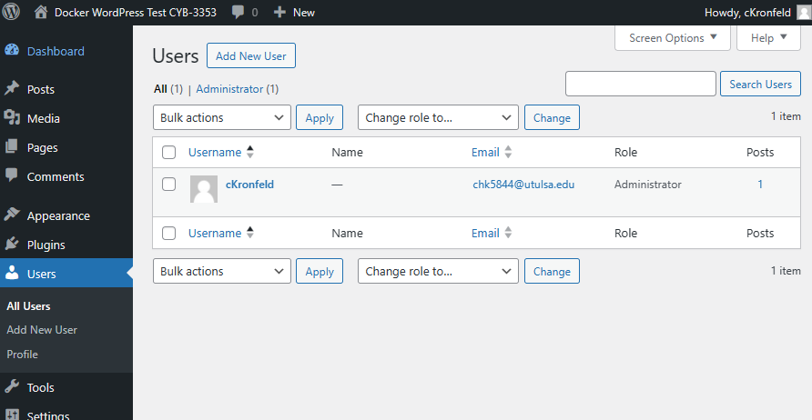
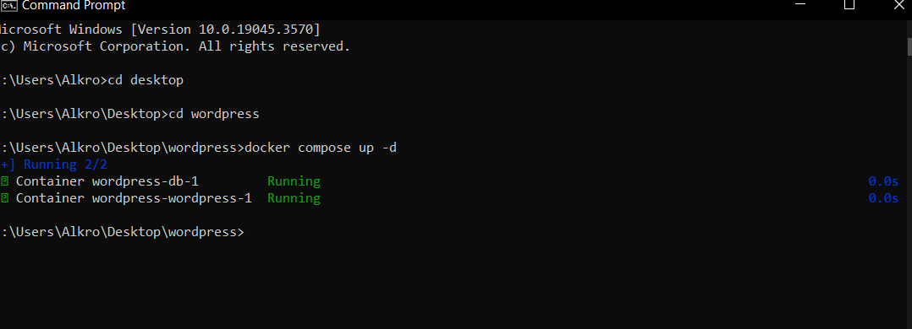

# Docker Setup for WordPress

## Step 1: installing Docker:

I installed Docker using the Docker Desktop for Windows.

This option had many errors when I first attempted it on my PC, but upon installing it on my laptop it worked much better. I believe it had something to do with the WSL installation on my PC.
I downloaded it from [docker.com](https://www.docker.com/products/docker-desktop/) and chose the Windows64x version. 

Then I set it up and made a Docker account.

# Step 2: creating WordPress using guide (hostinger.com):
The first thing I did was open my CMD Prompt to check that my Docker Compose was installed correctly.
I did this by running:

```
docker compose version
```

I then proceeded to make a directory for the WordPress on my desktop. I CD'd to my desktop in CMD and then used:

```
mkdir wordpress
```
I then navigated again to the new directory to make a new file.

```
cd wordpress
```

Now to make this new file (docker-compose.yml):
I typed out this code into my new yml file : 

```
version: "3" 
# Defines which compose version to use
services:
  # Services line define which Docker images to run. In this case, it will be MySQL server and WordPress image.
  db:
    image: mysql:5.7
    # image: mysql:5.7 indicates the MySQL database container image from Docker Hub used in this installation.
    restart: always
    environment:
      MYSQL_ROOT_PASSWORD: MyR00tMySQLPa$$5w0rD
      MYSQL_DATABASE: MyWordPressDatabaseName
      MYSQL_USER: MyWordPressUser
      MYSQL_PASSWORD: Pa$$5w0rD
      # Previous four lines define the main variables needed for the MySQL container to work: database, database username, database user password, and the MySQL root password.
  wordpress:
    depends_on:
      - db
    image: wordpress:latest
    restart: always
    # Restart line controls the restart mode, meaning if the container stops running for any reason, it will restart the process immediately.
    ports:
      - "8000:80"
      # The previous line defines the port that the WordPress container will use. After successful installation, the full path will look like this: http://localhost:8000
    environment:
      WORDPRESS_DB_HOST: db:3306
      WORDPRESS_DB_USER: MyWordPressUser
      WORDPRESS_DB_PASSWORD: Pa$$5w0rD
      WORDPRESS_DB_NAME: MyWordPressDatabaseName
# Similar to MySQL image variables, the last four lines define the main variables needed for the WordPress container to work properly with the MySQL container.
    volumes:
      ["./:/var/www/html"]
volumes:
  mysql: {}
```

I dragged it into my wordpress folder and moved on to starting the containers using this : 

```
docker compose up -d
```
# Step 3: setting up WordPress
Now that that is done, I went to my browser to test and make sure the WordPress was working and was ready to be setup:

I went to:
```
http://localhost:8000

```


I selected English and filled out the text boxes to created my WordPress.

I have completed my WordPress! Here is the admin interface with my username:



Here is an image of my containers running: 



