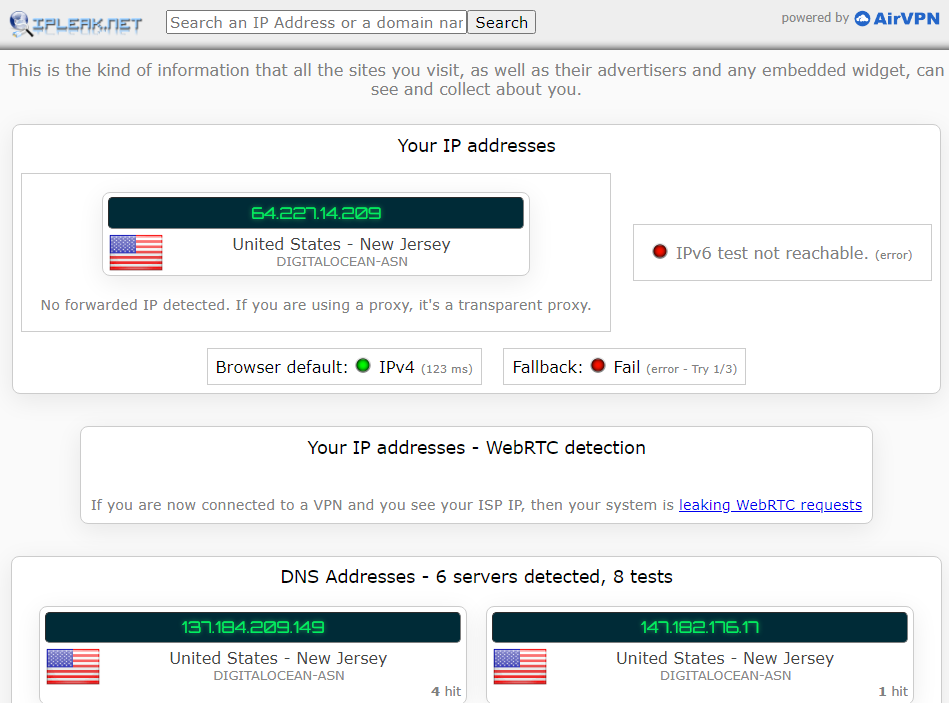
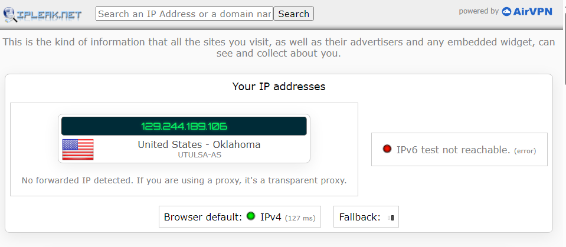
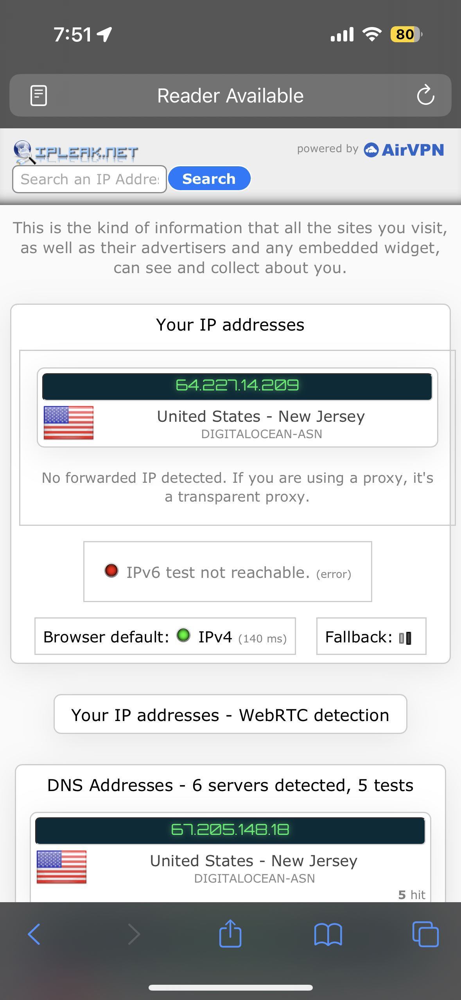
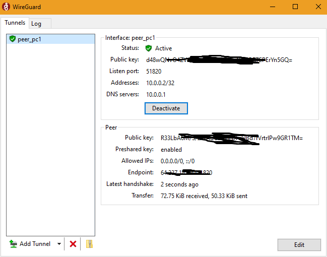
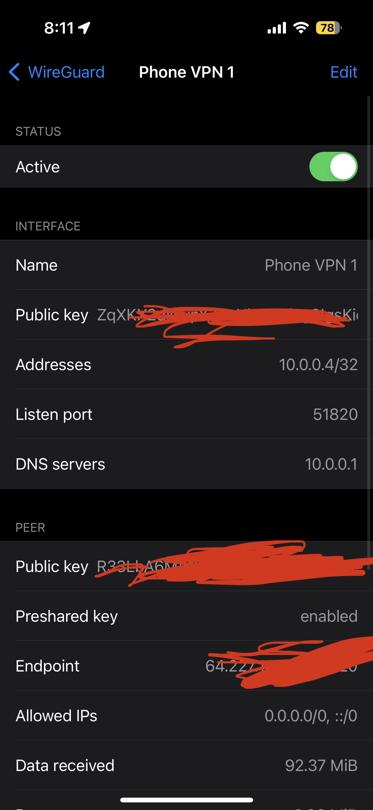
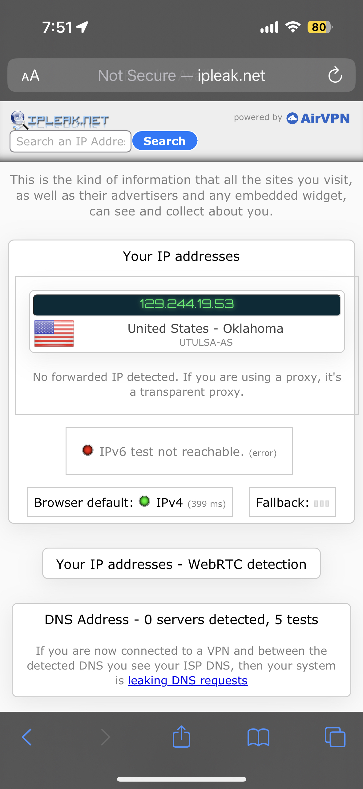

# WireGuard Setup

## Step 1:
I first created an account with the link provided by my teacher on [digitalocean.com]. I then created the Droplet and made a root with a basic password.

## Step 2

After I typed this into console on DO for my Droplet:
```
mkdir -p ~/wireguard/
mkdir -p ~/wireguard/config/
nano ~/wireguard/docker-compose.yml
```

I wrote out this block of code into the docker-compose.yml file using nano:
```
version: '3.8'
services:
  wireguard:
    container_name: wireguard
    image: linuxserver/wireguard
    environment:
      - PUID=1000
      - PGID=1000
      - TZ=America/Chicago
      - SERVERURL=64.227.14.209
      - SERVERPORT=51820
      - PEERS=pc1,pc2,phone1
      - PEERDNS=auto
      - INTERNAL_SUBNET=10.0.0.0
    ports:
      - 51820:51820/udp
    volumes:
      - type: bind
        source: ./config/


```

To make this work for yourself, change your server url to your IP given by your droplet and change it to your timezone.
## Step 3

Lastly, I started my containers using the same code from the Docker project:
```
cd ~/wireguard/
docker-compose up -d
```

I downloaded WireGuard on to both my computer and my iPhone and enabled the vpns using the .conf files and the qr code both generated from:

```
docker-compose ogs -f wireguard
```


These are images showing the VPN before and after as well as its active state:





